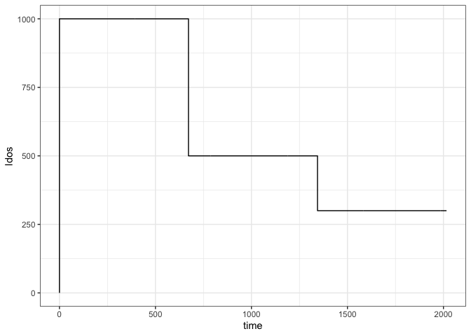
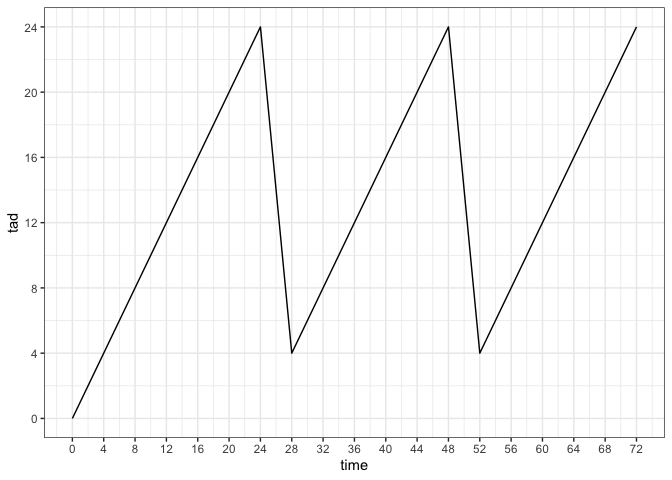
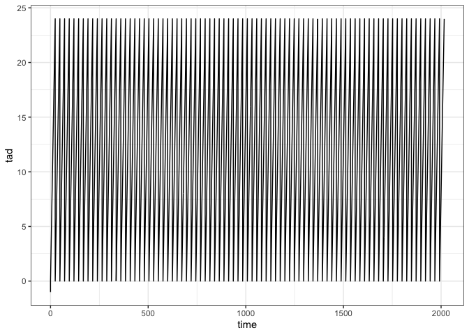
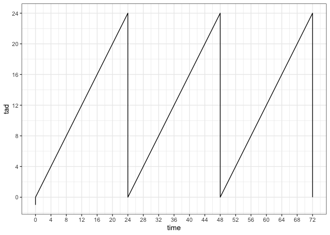

# lastdose

Calculate the time since and amount of the last dose.

``` r
library(lastdose)
library(tidyverse)
theme_set(theme_bw())

file <- system.file("csv/data1.csv", package = "lastdose")

df <- read.csv(file) 

head(df)
```

    .   ID time evid  amt cmt ii addl   DV
    . 1  1    0    0    0   0  0    0  0.0
    . 2  1    0    1 1000   1 24   27  0.0
    . 3  1    4    0    0   0  0    0 42.1
    . 4  1    8    0    0   0  0    0 35.3
    . 5  1   12    0    0   0  0    0 28.9
    . 6  1   16    0    0   0  0    0 23.6

## A PK profile

``` r
df %>% filter(evid==1) %>% count(time,amt,addl)
```

    . # A tibble: 3 x 4
    .    time   amt  addl     n
    .   <int> <int> <int> <int>
    . 1     0  1000    27     1
    . 2   672   500    27     1
    . 3  1344   300    27     1

``` r
ggplot(df, aes(time,DV)) + geom_line() + theme_bw()
```

<!-- -->

# Plot last dose versus time

``` r
x <- lastdose(df)

df <- mutate(df, tad = x$tad, ldos = x$ldos)

ggplot(df, aes(time,ldos)) + geom_line()
```

<!-- -->

# Plot time after dose versus time

``` r
ggplot(df, aes(time,tad)) + geom_line()
```

<!-- -->

``` r
ggplot(df, aes(time,tad)) + geom_line() + 
  scale_x_continuous(breaks = seq(0,72,4), limits=c(0,72)) + 
  scale_y_continuous(breaks = seq(0,24,4), limits=c(0,24)) 
```

<!-- -->

# All doses explicit in the data set

``` r
df2 <- mrgsolve::realize_addl(df) 

x <- lastdose(df2)

df2 <- mutate(df2, tad = x$tad, ldos = x$ldos)

ggplot(df2, aes(time,tad)) + geom_line()
```

<!-- -->

``` r
ggplot(df2, aes(time,tad)) + geom_line() + 
  scale_x_continuous(breaks = seq(0,72,4), limits = c(0,72)) + 
  scale_y_continuous(breaks = seq(0,24,4))
```

<!-- -->

# How does it perform on bigger data?

Same setup as the previous profile, but more individuals.

``` r
file <- system.file("csv/data_big.RDS", package = "lastdose")

big <- readRDS(file)

dim(big)
```

    . [1] 508000      8

``` r
length(unique(big$ID))
```

    . [1] 1000

``` r
system.time(x2 <- lastdose(big))
```

    .    user  system elapsed 
    .   0.176   0.005   0.182

## Compare against the single profile

``` r
system.time(x1 <- lastdose(df))
```

    .    user  system elapsed 
    .       0       0       0

``` r
x3 <- filter(x2, big[["ID"]]==1)

identical(x1,x3)
```

    . [1] TRUE
