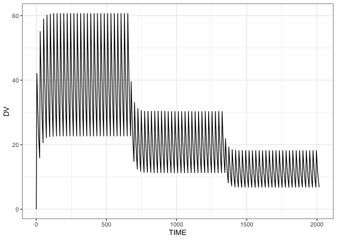
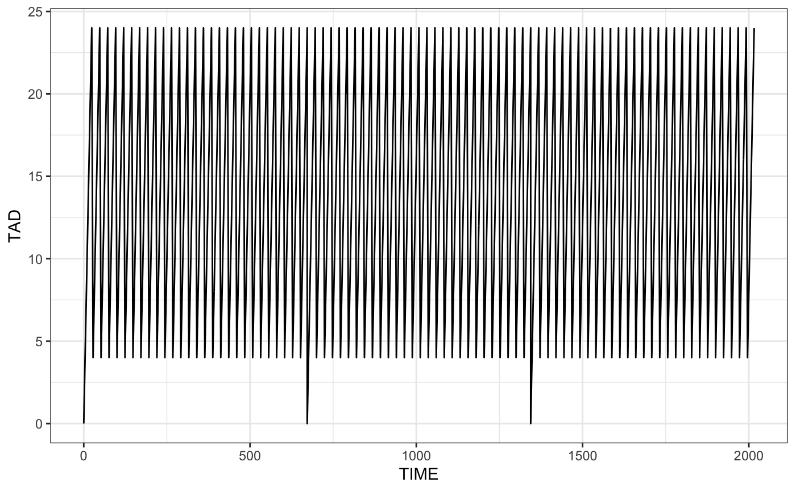
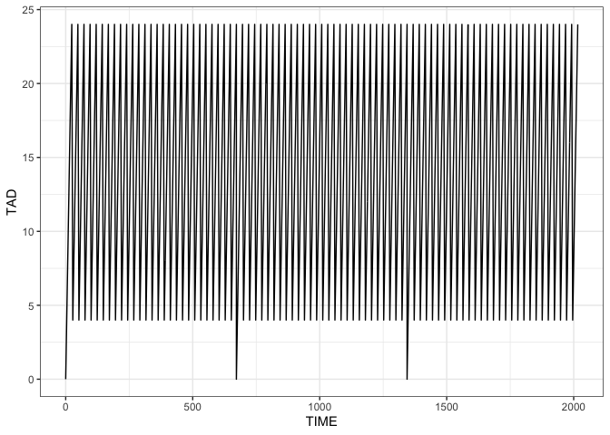
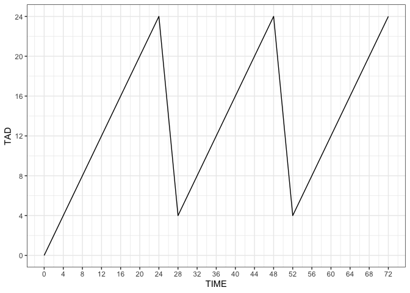
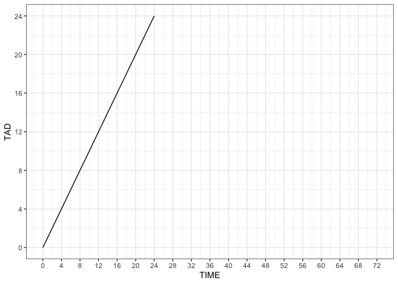
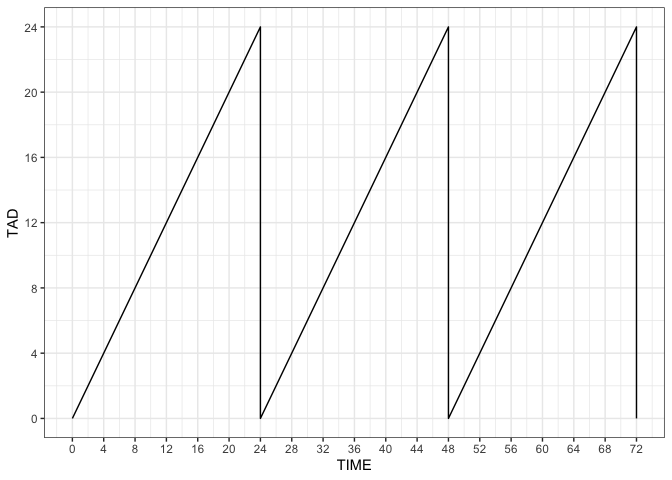

# lastdose

<!-- badges: start -->

[](https://travis-ci.org/metrumresearchgroup/lastdose)
<!-- badges: end -->

## Overview

Calculate the time since and amount of the last dose. Additional
(`ADDL`) dosing records are expanded and included in the calculation.

## Installation

``` r
remotes::install_github("metrumresearchgroup/lastdose")
```

``` r
library(lastdose)
library(tidyverse)
theme_set(theme_bw())
```

## A PK profile

We’ll use this PK profile as an example

``` r
file <- system.file("csv/data1.csv", package = "lastdose")

df <- read.csv(file) 

head(df)
```

    .   ID TIME EVID  AMT CMT II ADDL   DV
    . 1  1    0    0    0   0  0    0  0.0
    . 2  1    0    1 1000   1 24   27  0.0
    . 3  1    4    0    0   0  0    0 42.1
    . 4  1    8    0    0   0  0    0 35.3
    . 5  1   12    0    0   0  0    0 28.9
    . 6  1   16    0    0   0  0    0 23.6

The dosing runs over 12 weeks and there are 3 epochs, with 3 different
doses, most of which are scheduled into the future via `ADDL`.

``` r
df %>% filter(EVID==1) %>% count(TIME,AMT,ADDL)
```

    . # A tibble: 3 x 4
    .    TIME   AMT  ADDL     n
    .   <int> <int> <int> <int>
    . 1     0  1000    27     1
    . 2   672   500    27     1
    . 3  1344   300    27     1

``` r
ggplot(df, aes(TIME,DV)) + geom_line() + theme_bw()
```

<!-- -->

## Calculate TAD and LDOS

Use the `lastdose()` function

``` r
df <- lastdose(df)

head(df)
```

    .   ID TIME EVID  AMT CMT II ADDL   DV TAD LDOS
    . 1  1    0    0    0   0  0    0  0.0   0    0
    . 2  1    0    1 1000   1 24   27  0.0   0 1000
    . 3  1    4    0    0   0  0    0 42.1   4 1000
    . 4  1    8    0    0   0  0    0 35.3   8 1000
    . 5  1   12    0    0   0  0    0 28.9  12 1000
    . 6  1   16    0    0   0  0    0 23.6  16 1000

Now we have `TAD` and `LDOS` in our data set.

## Plot last dose versus time

``` r
ggplot(df, aes(TIME,LDOS)) + geom_line()
```

<!-- -->

## Plot time after dose versus time

``` r
ggplot(df, aes(TIME,TAD)) + geom_line()
```

<!-- -->

Observations before doses at the same time by default

``` r
ggplot(df, aes(TIME,TAD)) + geom_line() + 
  scale_x_continuous(breaks = seq(0,72,4), limits=c(0,72)) + 
  scale_y_continuous(breaks = seq(0,24,4), limits=c(0,24)) 
```

<!-- -->

You can also make doses “happen” first

``` r
dd <- lastdose(df, addl_ties = "dose_first")

ggplot(dd, aes(TIME,TAD)) + geom_line() + 
  scale_x_continuous(breaks = seq(0,72,4), limits=c(0,72)) + 
  scale_y_continuous(breaks = seq(0,24,4), limits=c(0,24)) 
```

<!-- -->

## All doses explicit in the data set

``` r
df2 <- mrgsolve::realize_addl(df) %>% lastdose()

ggplot(df2, aes(TIME,TAD)) + geom_line() + 
  scale_x_continuous(breaks = seq(0,72,4), limits = c(0,72)) + 
  scale_y_continuous(breaks = seq(0,24,4))
```

<!-- -->

## How does it perform on bigger data?

Same setup as the previous profile, but more individuals.

We have 500K rows and 1000 individuals

``` r
file <- system.file("csv/data_big.RDS", package = "lastdose")

big <- readRDS(file)

dim(big)
```

    . [1] 508000      8

``` r
length(unique(big$ID))
```

    . [1] 1000

Timing result

``` r
system.time(x2 <- lastdose(big))
```

    .    user  system elapsed 
    .   0.047   0.001   0.048

## Compare against the single profile

``` r
system.time(x1 <- lastdose(df))
```

    .    user  system elapsed 
    .       0       0       0

``` r
x3 <- filter(x2, big[["ID"]]==1) %>% as.data.frame()

all.equal(x1,x3)
```

    . [1] TRUE

## Observations prior to the first dose

When non-dose records happen prior to the first dose, lastdose
calculates the time before the first dose (a negative value) for these
records.

``` r
file <- system.file("csv/data2.csv", package = "lastdose")

df <- read_csv(file)

lastdose(df) %>% head()
```

    . # A tibble: 6 x 10
    .      ID  TIME  EVID   AMT   CMT    II  ADDL    DV   TAD  LDOS
    .   <dbl> <dbl> <dbl> <dbl> <dbl> <dbl> <dbl> <dbl> <dbl> <dbl>
    . 1     1     0     0     0     0     0     0   0     -12     0
    . 2     1     4     0     0     0     0     0   0      -8     0
    . 3     1     8     0     0     0     0     0   0      -4     0
    . 4     1    12     0     0     0     0     0   0       0     0
    . 5     1    12     1  1000     1    24    27   0       0  1000
    . 6     1    16     0     0     0     0     0  23.6     4  1000

The user can alternatively control what happens for these records

``` r
lastdose(df, fill = NA_real_, back_calc=FALSE) %>% head()
```

    . # A tibble: 6 x 10
    .      ID  TIME  EVID   AMT   CMT    II  ADDL    DV   TAD  LDOS
    .   <dbl> <dbl> <dbl> <dbl> <dbl> <dbl> <dbl> <dbl> <dbl> <dbl>
    . 1     1     0     0     0     0     0     0   0      NA     0
    . 2     1     4     0     0     0     0     0   0      NA     0
    . 3     1     8     0     0     0     0     0   0      NA     0
    . 4     1    12     0     0     0     0     0   0      NA     0
    . 5     1    12     1  1000     1    24    27   0       0  1000
    . 6     1    16     0     0     0     0     0  23.6     4  1000

<hr>

## More info

See
[inst/doc/about.md](https://github.com/metrumresearchgroup/lastdose/blob/master/inst/doc/about.md)
for more details.
